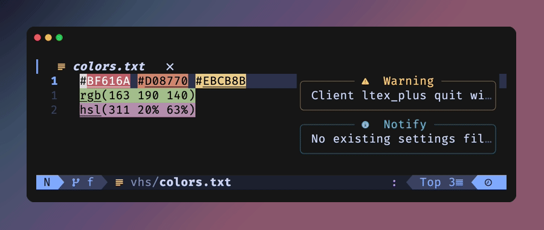
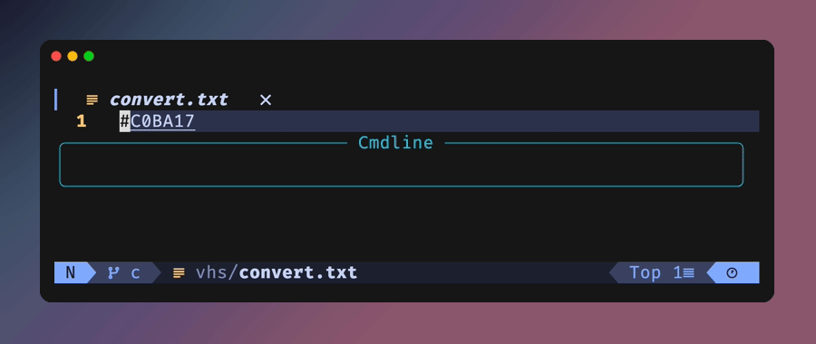
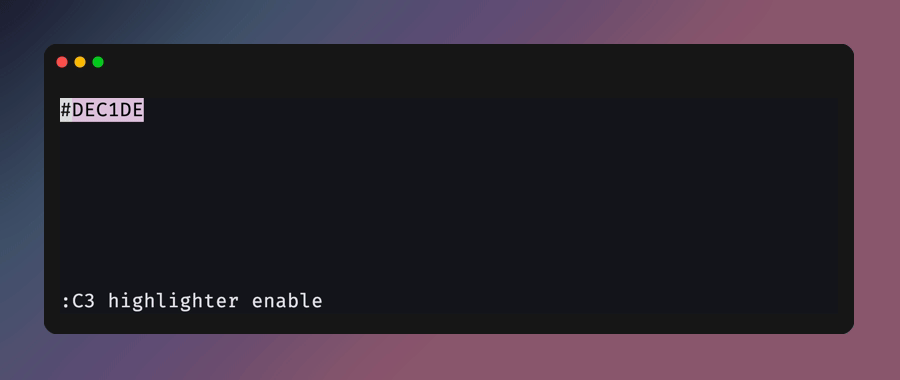
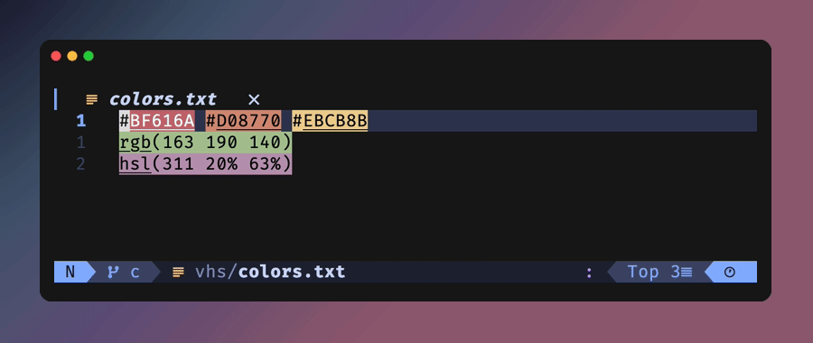
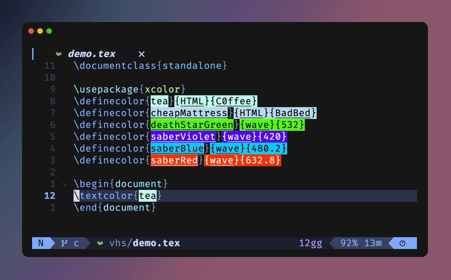

<!--toc:start-->

- [C-3PO.nvim](#c-3ponvim)
- [Install](#install)
- [Configuration](#configuration)
  - [LaTeX (xcolor)](#latex-xcolor)
  - [Completion](#completion)
- [Demo](#demo)
  - [Pick](#pick)
  - [Highlight and convert](#highlight-and-convert)
  - [Yank in any format](#yank-in-any-format)
  - [Restore previously used colors](#restore-previously-used-colors)
  - [Complete your project's colors](#complete-your-projects-colors)

<!--toc:end-->

# C-3PO.nvim

> _"I am C-3PO, human–cyborg relations. I am fluent in over six million forms
> of communication."_

A protocol droid for color. It reads whatever dialect the buffer speaks — hex,
`rgb()`, `oklch()`, xcolor's `{cmyk}` — and translates it into whichever one
you need, without you ever having to think in numbers.

The **C-3** is inherited from [uga-rosa/ccc.nvim](https://github.com/uga-rosa/ccc.nvim)
(**C**reate **C**olor **C**ode), which this started as a fork of and remains
indebted to. The **PO** followed naturally.

- Features
  - No dependency.
  - One `:C3` command, with subcommands, completion and a menu.
  - Dynamic highlighting of sliders, clickable ends, mouse and scroll support.
  - More than 10 color spaces to edit in (RGB, HSL, CMYK, OKLCH, ...), switched
    without leaving the picker.
  - Reads and writes CSS Color Level 4 and every LaTeX xcolor model, `{wave}`
    included.
  - Picks up where it found you: a `{cmyk}` spec reopens on CMYK sliders and is
    written back as `{cmyk}`.
  - Project-wide xcolor named colors — `\textcolor{R2D2}` carries the color
    its `\definecolor` gives it, wherever in the project that definition lives.
  - Completion of those names, as a blink.cmp source or through `'omnifunc'`.
  - Yank a color in any format without touching the buffer.
  - Restore previously used colors.
  - Programmable modules (input/output/picker).

- Requirements
  - neovim 0.12+

See [doc](./doc/c3po.txt) for the full reference.

# Install

With [lazy.nvim](https://github.com/folke/lazy.nvim):

```lua
{
  "dpezto/C-3PO.nvim",
  cmd = "C3",
  opts = {
    highlighter = { auto_enable = true },
  },
}
```

No dependencies, any plugin manager works. Nothing is set up until
`require("c3po").setup()` runs, so pass `opts`/`config`.

# Configuration

Every option with its default. Pass only the ones you want to change.

```lua
opts = {
  -- Color spaces the sliders can work in. `i` cycles them.
  inputs = { "rgb", "hsl", "cmyk" },
  -- Formats a color can be written as. `o` cycles them; the first is the
  -- default and the fallback for `:C3 yank`.
  outputs = { "hex", "hex_short", "css_rgb", "css_hsl" },
  -- Formats recognized under the cursor, by `:C3 pick`, `:C3 yank` and the
  -- highlighter.
  pickers = { "hex", "css_rgb", "css_hsl", "css_hwb",
              "css_lab", "css_lch", "css_oklab", "css_oklch" },
  -- `:C3 convert` cycle: each format converts to the next, the last back to
  -- the first.
  convert = { "hex", "css_rgb", "css_hsl" },
  -- Open the picker on the format that was found, and write it back the same
  -- way, instead of always falling back to the first input/output.
  recognize = { input = false, output = false },

  highlighter = {
    auto_enable = false, -- attach on every buffer that gets a filetype
    max_byte = 100 * 1024,
    filetypes = {}, -- allow-list; empty means every filetype
    excludes = {},
    picker = true,
    update_insert = true, -- repaint while typing
  },

  highlight_mode = "bg", -- "bg" | "fg" | "virtual"
  virtual_symbol = " ● ",
  virtual_pos = "inline-left",
  lsp = true, -- ask the language server before the pickers
  latex_completion = false, -- see Completion below

  -- Picker UI.
  bar_len = 30,
  bar_char = "━",
  point_char = "█",
  alpha_show = "auto",
  max_prev_colors = 10,
  preserve = false,
  save_on_quit = false,
  auto_close = true,
}
```

## LaTeX (xcolor)

`"latex"` alone reads and highlights every xcolor model — `{RGB}`, `{rgb}`,
`{HTML}`, `{cmyk}`, `{cmy}`, `{hsb}`, `{Hsb}`, `{HSB}`, `{tHsb}`, `{gray}`,
`{Gray}`, `{wave}`. Outputs are per model, so you enable only the ones you
write. `"latex_name"` resolves colors used by name against every `\definecolor`
in the project.

```lua
opts = {
  inputs  = { "rgb", "hsl", "cmyk", "hsv", "gray" },
  outputs = { "hex", "latex_rgb", "latex_cmyk", "latex_html" },
  pickers = {
    "hex", "css_rgb",
    -- Single-model views. They carry the recognition, so they come first.
    "latex_rgb_float", "latex_rgb", "latex_cmyk", "latex_html",
    "latex_gray15", "latex_gray",
    "latex", "latex_name",
  },
  recognize = { input = true, output = true },
}
```

Two orderings matter, because those pairs overlap: `latex_rgb_float` before
`latex_rgb` (the latter matches both `{rgb}` and `{RGB}`) and `latex_gray15`
before `latex_gray` (the latter matches both `{gray}` and `{Gray}`). Keep
`"latex"` last as the catch-all for the models with no dedicated view.

There is no `{wave}` output: xcolor has no conversion *into* a wavelength, so a
`{wave}` spec is read and highlighted but written back in another format.

The name span is highlight-only. `:C3 pick` deliberately skips it — overwriting
`R2D2` with `#0070c0` would throw away the indirection the document is
built on. Put the cursor on the specification to edit a definition, and use
`:C3 yank` to read a named color.

## Completion

Names defined anywhere in the project are completed inside `\textcolor{`,
`\color{`, `\colorbox{` and friends. With
[blink.cmp](https://github.com/saghen/blink.cmp), register the source — no
`latex_completion` needed:

```lua
-- blink.cmp opts
sources = {
  per_filetype = { tex = { inherit_defaults = true, "c3po" } },
  providers = { c3po = { name = "Color", module = "c3po.blink" } },
}
```

Entries come through as ordinary LSP items of kind `Color`, so they pick up
your `Color` icon, and while the highlighter is enabled the icon is drawn in
the color the name stands for.

Without a completion engine, set `latex_completion = true`. It wraps
`'omnifunc'` on tex buffers for `<C-x><C-o>` and hands every non-color
completion back to whatever function was there before, so vimtex keeps
completing `\cite` and `\ref`.

# Demo

All recordings are generated with [vhs](https://github.com/charmbracelet/vhs)
from the tapes in [`vhs/`](./vhs) — `make demo` re-records them.

The tapes deliberately load **your** Neovim config rather than a pinned minimal
one, so the demos show the plugin in a real editor — real colorscheme, real
statusline, real completion engine. `vhs/demo-init.lua` is only a shim: it runs
before plugins, silences startup notifications and stops language servers, none
of which have anything to say about color. That means recording needs this repo
checked out where your config picks it up (lazy.nvim's `dev`), and your gifs
will not look identical to the ones above.

## Pick

`:C3 pick` — sliders for the color under the cursor, `i`/`o` cycle the input
color space and the output format (CSS, hex, LaTeX xcolor, ...), `a` toggles
transparency.



## Highlight and convert

The highlighter paints every configured format in place, xcolor specifications
included. `:C3 convert` then cycles the color under the cursor through your
`convert` list without opening the UI.

LSP colors (`textDocument/documentColor`) are highlighted natively by neovim's
`vim.lsp.document_color`; c3po picks them up in `:C3 pick` and `:C3 yank`.



## Yank in any format

`:C3 yank [output]` — grab the color under the cursor in any output format,
buffer untouched.



## Restore previously used colors

Inside the picker, `g` opens the history row and `<CR>` applies the selected
color (`w`/`b` walk the row when there is more than one).



## Complete your project's colors

Every `\definecolor` in the project, offered by name, each entry wearing the
color it stands for.


