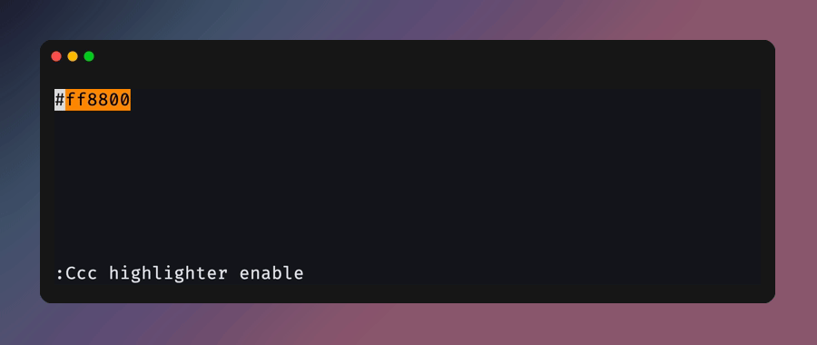
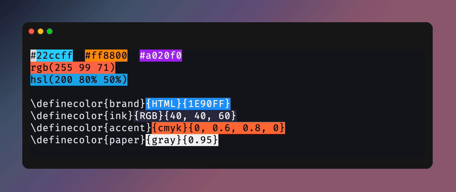

<!--toc:start-->
- [C-3PO.nvim](#c-3ponvim)
- [Install](#install)
- [Demo](#demo)
  - [Pick](#pick)
  - [Convert in place](#convert-in-place)
  - [Yank in any format](#yank-in-any-format)
  - [Restore previously used colors](#restore-previously-used-colors)
  - [Highlighter](#highlighter)
<!--toc:end-->

<!--  -->

# C-3PO.nvim

> *"I am C-3PO, human–cyborg relations. I am fluent in over six million forms
> of communication."*

A protocol droid for color. It reads whatever dialect the buffer speaks — hex,
`rgb()`, `oklch()`, xcolor's `{cmyk}` — and translates it into whichever one
you need, without you ever having to think in numbers.

The **C-3** is inherited from [uga-rosa/ccc.nvim](https://github.com/uga-rosa/ccc.nvim)
(**C**reate **C**olor **C**ode), which this started as a fork of and remains
indebted to. The **PO** followed naturally.

- Features
    - No dependency.
    - One `:Ccc` command, with subcommands, completion and a menu.
    - Dynamic highlighting of sliders, clickable ends, mouse and scroll support.
    - Supports more than 10 color spaces (RGB, HSL, CMYK, OKLCH, etc.).
    - Seamless input/output mode change.
    - Restore previously used colors.
    - Transparent slider for css functions (e.g. `rgb()`, `hsl()`)
    - CSS Color Level 4 and LaTeX (xcolor) formats, in both directions.
    - Yank a color in any format without touching the buffer.
    - Color Highlighter for many formats.
    - Programmable modules (input/output/picker)

- Requirements
    - neovim 0.12+

See [doc](./doc/ccc.txt) for details.

# Install

With [lazy.nvim](https://github.com/folke/lazy.nvim):

```lua
{
  "dpezto/ccc.nvim",
  cmd = "Ccc",
  opts = {
    highlighter = { auto_enable = true },
  },
}
```

No dependencies, any plugin manager works. Nothing is set up until
`require("ccc").setup()` runs, so pass `opts`/`config`.

# Demo

All recordings are generated with [vhs](https://github.com/charmbracelet/vhs)
from the tapes in [`vhs/`](./vhs) — `make demo` re-records them.

## Pick

`:Ccc pick` — sliders for the color under the cursor, `i`/`o` cycle the input
color space and the output format (CSS, hex, LaTeX xcolor, ...), `a` toggle transparency.


## Convert in place

`:Ccc convert` — cycle the color through your configured formats without
opening the UI.



## Yank in any format

`:Ccc yank [output]` — grab the color under the cursor in any output format,
buffer untouched.


## Restore previously used colors

Inside the picker, `g` opens the history row and `<CR>` applies the selected
color (`w`/`b` walk the row when there is more than one).


## Highlighter

Highlights every configured format, xcolor specifications included. LSP colors
(`textDocument/documentColor`) are highlighted natively by neovim's
`vim.lsp.document_color`; ccc picks them up in `:Ccc pick` and `:Ccc yank`.


